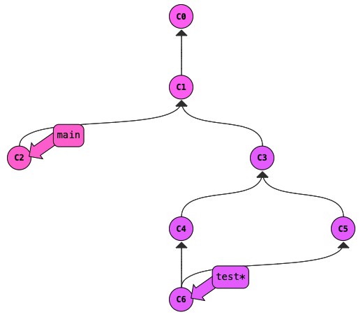
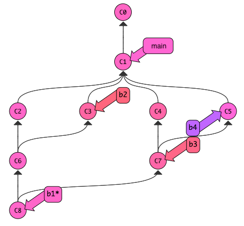

# Git Simulator

Let's start by practicing in the Git simulator <a
href="https://tyler.caraza-harter.com/cs320/learnGitBranching/index.html"
target="_blank">here</a>.  

Useful commands for the above problem:
* `git commit`: make a new commit
* `git branch bname`: create a branch named `bname`
* `git checkout bname`: move `HEAD` to the commit referenced by the `bname`
* `git checkout c1`: move `HEAD` to the `c1` commit
* `git merge bname`: merge changes on the `bname` branch into the current branch
* `git branch -D bname`: delete the branch named `bname`

These are just for git simulator and will **not** work when actually using Git
* `undo`: undo the most recent command
* `reset`: brings you back to just having C0

Try to run commands to get to the following state (if you get stuck, check the [solution here](solution.md)):

### When submitting projects this semester, we will be using a Git workflow. Branches have been created for each of the Machine Projects. The suggested general order that we will do this is as follows:
- Make sure you are in the correct directory. (e.g., for the first project, you should be in the mp1 directory).
- Checkout the main branch using `git checkout main` and run `git pull` to update your local repository with the latest files. 
- Checkout the respective project branch (e.g., MP1) using `git checkout MP1` and merge the latest changes from the main branch using `git merge main`.
- After merging, work on your project on the project branch. 
- Add, commit, and push your changes frequently to the remote project branch using git push to ensure easy retrieval and backup.
- Run `git status` regularly to verify that you're on the correct project branch.
- Once ready to submit, `git add <filename>`, `git commit -m "commit message"`, and `git push` all of your work to the remote project branch. 
- Switch back to the main branch using `git checkout main` and pull the latest updates before starting the next project (as mentioned in step 1).

If you have some free time at the end of the lab, you can try out the following challenge. 

Try to get to this state (no answer to check for this one, so you'll need to work for it!): 

**Hint:** Start by creating commits on four branches, b1, b2, b3, and b4.
Merge b2 into b1 and b4 into b3.  Then merge the two merge commits
with a third merge commit.
